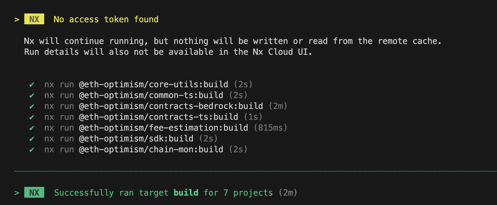
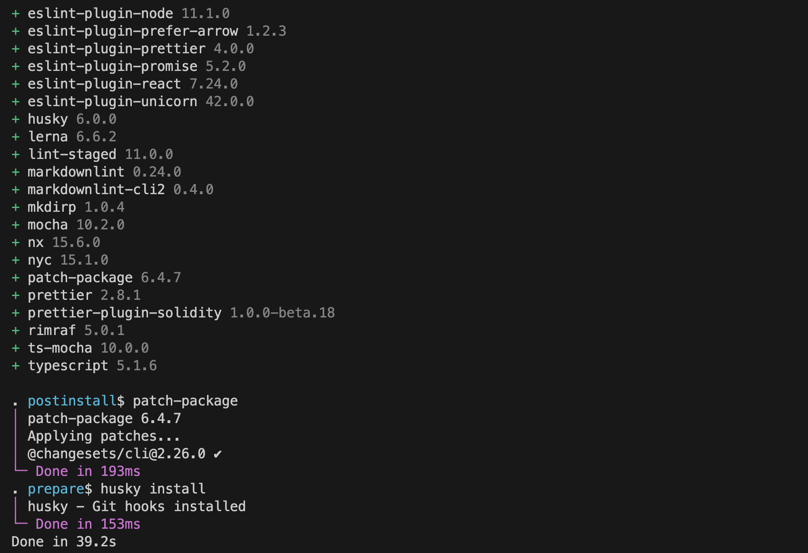
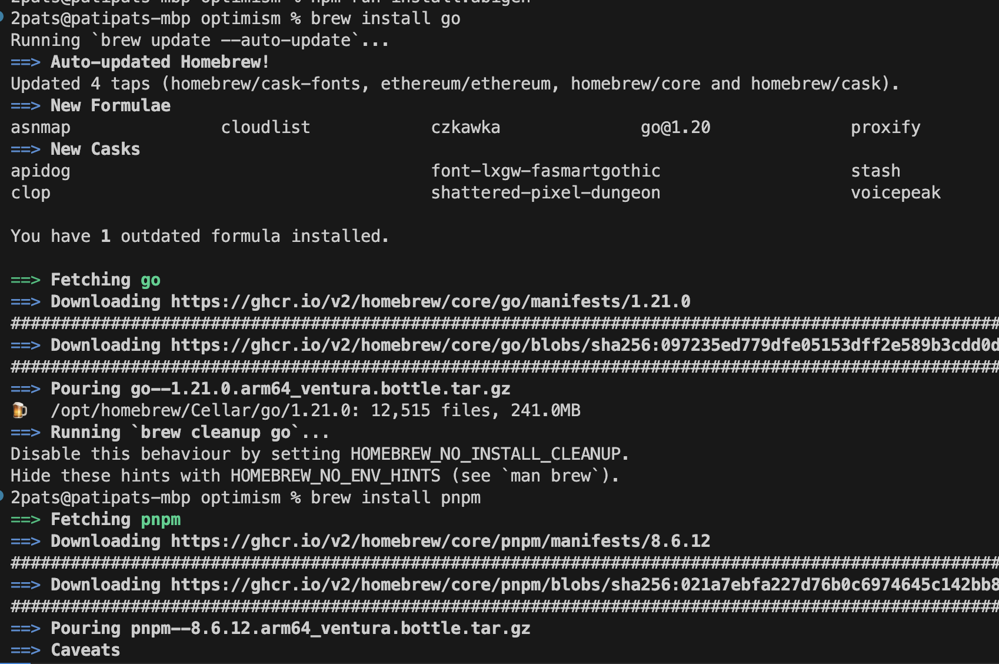
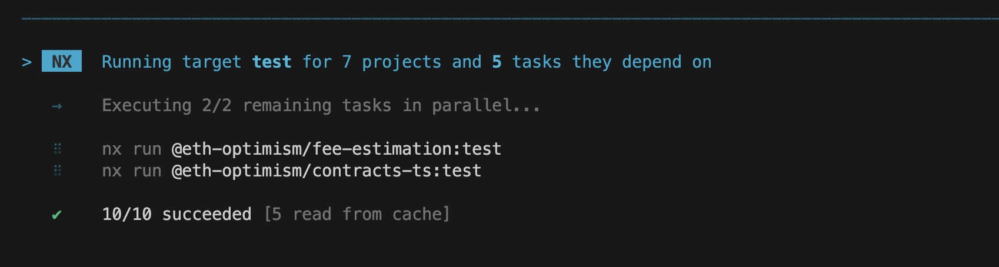

# Review: Optimism Monorepo Contributions Process

## Introduction

This is my personal review of the Optimism Monorepo Contributions Process. I am not a member of the Optimism team, and this review is not endorsed by the Optimism team. Just a friendly review from a community member. Follow me to explore the SuperChain together 🚀.

[Contributions Board Link](https://github.com/orgs/ethereum-optimism/projects/31/views/3?filterQuery=label%3A%22Estimated+Effort%3A+Small%22&pane=issue&itemId=28949460)

## Summary

Overall, I had no hiccups in the main steps. Everything build just fine and I was able to run the tests and build the packages! I also learned a few things to keep in mind along the way! Perhaps you are newer to the ecosystem as well and might find this process helpful shaking the stagefright of contributing to a large project. Here were my main takeaways:

- "No contribution is too small and all contributions are valued" - The ethos is based on being "aggressively opensource" and this is very welcoming to see, especally as a someone newer to public contributions.

- Keep an eye out for the "good first issue" label - This is a great way to get started with a project. I'm hoping to look throught those and take on my next contribution. ^^

- Make sure to do a clean build after switching branches.

- Write appropriate tests when submitting new features!

- Keep in mind https://www.conventionalcommits.org/en/v1.0.0/ when writing commit messages. I'm new to this, so I'm pinning it in my browser!

Let me know if you can relate to this experience or are experiencing something different.

Checkout some terminal selfies below :D

